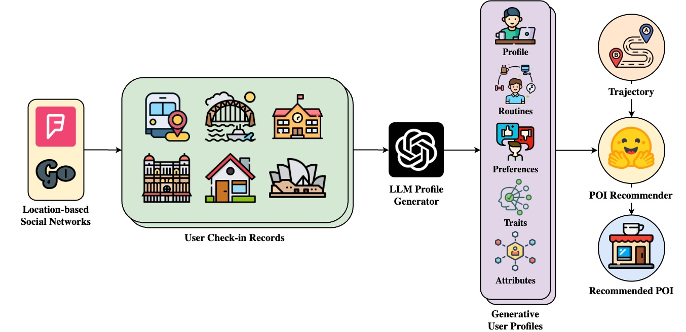

# GenUP: Generative User Profilers as In-Context Learners for Next POI Recommender Systems

<div align="center">

### [Wilson Wongso](https://wilsonwongso.dev)<sup>1,2</sup>, [Hao Xue](https://www.unsw.edu.au/staff/hao-xue)<sup>1,2</sup>, and [Flora Salim](https://fsalim.github.io/)<sup>1,2</sup>

<sup>1</sup> School of Computer Science and Engineering, University of New South Wales, Sydney, Australia<br/>
<sup>2</sup> ARC Centre of Excellence for Automated Decision Making + Society

[](https://huggingface.co/collections/w11wo/genup-66d7e794169f9a7cb88c3f60)
[](https://arxiv.org/abs/2410.20643)
[](https://www.python.org/downloads/release/python-3100/)
[](https://pytorch.org/get-started/locally/)

</div>

## 📖 Introduction



GenUP is a framework that leverages generative user profiles as in-context learners for next POI recommender systems. It utilizes large language models (LLMs) to generate user profiles from check-in records, which are then used to predict the next point of interest (POI) in a user's trajectory.

## 🔢 Datasets

### LLM4POI Datasets

We followed the dataset preparation of [LLM4POI](https://github.com/neolifer/LLM4POI) for the FourSquare-NYC, Gowalla-CA, and FourSquare-TKY datasets. We also provide the processed datasets on [🤗 Hugging Face](https://huggingface.co/datasets/w11wo/LLM4POI) Please refer to their repository for more details.

> ❗️ Moscow and Sao Paulo preprocessing steps will be made available soon.

| Dataset             | URL                                                                |
| ------------------- | ------------------------------------------------------------------ |
| FourSquare-NYC      | [🤗](https://huggingface.co/datasets/w11wo/FourSquare-NYC-POI)      |
| FourSquare-TKY      | [🤗](https://huggingface.co/datasets/w11wo/FourSquare-TKY-POI)      |
| Gowalla-CA          | [🤗](https://huggingface.co/datasets/w11wo/Gowalla-CA-POI)          |
| FourSquare-Moscow   | [🤗](https://huggingface.co/datasets/w11wo/FourSquare-Moscow-POI)   |
| FourSquare-SaoPaulo | [🤗](https://huggingface.co/datasets/w11wo/FourSquare-SaoPaulo-POI) |

### Generate User Profiles

To generate the user profiles from the check-in records, run the following commands:

```sh
python src/generate_user_profile.py --dataset nyc --dataset_id USERNAME/FourSquare-NYC-User-Profiles
python src/generate_user_profile.py --dataset ca --dataset_id USERNAME/Gowalla-CA-User-Profiles
python src/generate_user_profile.py --dataset tky --dataset_id USERNAME/FourSquare-TKY-User-Profiles
```

### Create Supervised Fine-tuning Dataset

And to create the SFT dataset using the user profiles and the POI data, run the following commands:

```sh
python src/create_sft_dataset.py --dataset nyc --dataset_id USERNAME/FourSquare-NYC-POI
python src/create_sft_dataset.py --dataset ca --dataset_id USERNAME/Gowalla-CA-POI
python src/create_sft_dataset.py --dataset tky --dataset_id USERNAME/FourSquare-TKY-POI
```

## 🚀 Supervised Fine-tuning

We provide the training scripts and recipes for the GenUP-Llama models demonstrated in our paper. In our setup, we used 2 H100 GPUs, QLoRA and FSDP for multi-GPU training, and the following hyperparameters:

#### Llama-2-7B-LongLoRA-32k

<details>
  <summary>FourSquare-NYC-POI</summary>

```sh
ACCELERATE_USE_FSDP=1 FSDP_CPU_RAM_EFFICIENT_LOADING=1 torchrun --nproc_per_node=2 src/train_sft_qlora_fsdp.py \
    --model_checkpoint "w11wo/Llama-2-7b-longlora-32k-merged" \
    --max_length 16384 \
    --batch_size 1 \
    --learning_rate 2e-5 \
    --max_grad_norm 1.0 \
    --warmup_steps 20 \
    --num_epochs 3 \
    --gradient_checkpointing \
    --apply_liger_kernel_to_llama \
    --dataset_id "w11wo/FourSquare-NYC-POI"
```
</details>

<details>
  <summary>Gowalla-CA-POI</summary>

```sh
ACCELERATE_USE_FSDP=1 FSDP_CPU_RAM_EFFICIENT_LOADING=1 torchrun --nproc_per_node=2 src/train_sft_qlora_fsdp.py \
    --model_checkpoint "w11wo/Llama-2-7b-longlora-32k-merged" \
    --max_length 16384 \
    --batch_size 2 \
    --learning_rate 2e-5 \
    --max_grad_norm 1.0 \
    --warmup_steps 20 \
    --num_epochs 3 \
    --gradient_checkpointing \
    --apply_liger_kernel_to_llama \
    --dataset_id "w11wo/Gowalla-CA-POI"
```
</details>

<details>
  <summary>FourSquare-TKY-POI</summary>

```sh
ACCELERATE_USE_FSDP=1 FSDP_CPU_RAM_EFFICIENT_LOADING=1 torchrun --nproc_per_node=2 src/train_sft_qlora_fsdp.py \
    --model_checkpoint "w11wo/Llama-2-7b-longlora-32k-merged" \
    --max_length 16384 \
    --batch_size 2 \
    --learning_rate 2e-5 \
    --max_grad_norm 1.0 \
    --warmup_steps 20 \
    --num_epochs 3 \
    --gradient_checkpointing \
    --apply_liger_kernel_to_llama \
    --dataset_id "w11wo/FourSquare-TKY-POI"
```
</details>

<details>
  <summary>FourSquare-Moscow-POI</summary>

```sh
ACCELERATE_USE_FSDP=1 FSDP_CPU_RAM_EFFICIENT_LOADING=1 torchrun --nproc_per_node=2 src/train_sft_qlora_fsdp.py \
    --model_checkpoint "w11wo/Llama-2-7b-longlora-32k-merged" \
    --max_length 16384 \
    --batch_size 2 \
    --learning_rate 2e-5 \
    --max_grad_norm 1.0 \
    --warmup_steps 20 \
    --num_epochs 3 \
    --gradient_checkpointing \
    --apply_liger_kernel_to_llama \
    --dataset_id "w11wo/FourSquare-Moscow-POI"
```
</details>

<details>
  <summary>FourSquare-SaoPaulo-POI</summary>

```sh
ACCELERATE_USE_FSDP=1 FSDP_CPU_RAM_EFFICIENT_LOADING=1 torchrun --nproc_per_node=2 src/train_sft_qlora_fsdp.py \
    --model_checkpoint "w11wo/Llama-2-7b-longlora-32k-merged" \
    --max_length 16384 \
    --batch_size 2 \
    --learning_rate 2e-5 \
    --max_grad_norm 1.0 \
    --warmup_steps 20 \
    --num_epochs 3 \
    --gradient_checkpointing \
    --apply_liger_kernel_to_llama \
    --dataset_id "w11wo/FourSquare-SaoPaulo-POI"
```
</details>

#### Llama-3.1-8B

<details>
  <summary>FourSquare-NYC-POI</summary>

```sh
ACCELERATE_USE_FSDP=1 FSDP_CPU_RAM_EFFICIENT_LOADING=1 torchrun --nproc_per_node=2 src/train_sft_qlora_fsdp.py \
    --model_checkpoint "meta-llama/Meta-Llama-3.1-8B" \
    --max_length 16384 \
    --batch_size 1 \
    --learning_rate 2e-4 \
    --max_grad_norm 1.0 \
    --warmup_steps 20 \
    --num_epochs 3 \
    --gradient_checkpointing \
    --apply_liger_kernel_to_llama \
    --dataset_id "w11wo/FourSquare-NYC-POI"
```
</details>

<details>
  <summary>Gowalla-CA-POI</summary>

```sh
ACCELERATE_USE_FSDP=1 FSDP_CPU_RAM_EFFICIENT_LOADING=1 torchrun --nproc_per_node=2 src/train_sft_qlora_fsdp.py \
    --model_checkpoint "meta-llama/Meta-Llama-3.1-8B" \
    --max_length 16384 \
    --batch_size 2 \
    --learning_rate 2e-4 \
    --max_grad_norm 1.0 \
    --warmup_steps 20 \
    --num_epochs 3 \
    --gradient_checkpointing \
    --apply_liger_kernel_to_llama \
    --dataset_id "w11wo/Gowalla-CA-POI"
```
</details>

<details>
  <summary>FourSquare-TKY-POI</summary>

```sh
ACCELERATE_USE_FSDP=1 FSDP_CPU_RAM_EFFICIENT_LOADING=1 torchrun --nproc_per_node=2 src/train_sft_qlora_fsdp.py \
    --model_checkpoint "meta-llama/Meta-Llama-3.1-8B" \
    --max_length 16384 \
    --batch_size 2 \
    --learning_rate 2e-4 \
    --max_grad_norm 1.0 \
    --warmup_steps 20 \
    --num_epochs 3 \
    --gradient_checkpointing \
    --apply_liger_kernel_to_llama \
    --dataset_id "w11wo/FourSquare-TKY-POI"
```
</details>

<details>
  <summary>FourSquare-Moscow-POI</summary>

```sh
ACCELERATE_USE_FSDP=1 FSDP_CPU_RAM_EFFICIENT_LOADING=1 torchrun --nproc_per_node=2 src/train_sft_qlora_fsdp.py \
    --model_checkpoint "meta-llama/Meta-Llama-3.1-8B" \
    --max_length 16384 \
    --batch_size 2 \
    --learning_rate 2e-4 \
    --max_grad_norm 1.0 \
    --warmup_steps 20 \
    --num_epochs 3 \
    --gradient_checkpointing \
    --apply_liger_kernel_to_llama \
    --dataset_id "w11wo/FourSquare-Moscow-POI"
```
</details>

<details>
  <summary>FourSquare-SaoPaulo-POI</summary>

```sh
ACCELERATE_USE_FSDP=1 FSDP_CPU_RAM_EFFICIENT_LOADING=1 torchrun --nproc_per_node=2 src/train_sft_qlora_fsdp.py \
    --model_checkpoint "meta-llama/Meta-Llama-3.1-8B" \
    --max_length 16384 \
    --batch_size 2 \
    --learning_rate 2e-4 \
    --max_grad_norm 1.0 \
    --warmup_steps 20 \
    --num_epochs 3 \
    --gradient_checkpointing \
    --apply_liger_kernel_to_llama \
    --dataset_id "w11wo/FourSquare-SaoPaulo-POI"
```
</details>

#### Llama-3.2-1B

<details>
  <summary>FourSquare-NYC-POI</summary>

```sh
ACCELERATE_USE_FSDP=1 FSDP_CPU_RAM_EFFICIENT_LOADING=1 torchrun --nproc_per_node=2 src/train_sft_qlora_fsdp.py \
    --model_checkpoint "meta-llama/Meta-Llama-3.2-1B" \
    --max_length 16384 \
    --batch_size 1 \
    --learning_rate 2e-4 \
    --max_grad_norm 1.0 \
    --warmup_steps 20 \
    --num_epochs 3 \
    --gradient_checkpointing \
    --apply_liger_kernel_to_llama \
    --dataset_id "w11wo/FourSquare-NYC-POI"
```
</details>

<details>
  <summary>Gowalla-CA-POI</summary>

```sh
ACCELERATE_USE_FSDP=1 FSDP_CPU_RAM_EFFICIENT_LOADING=1 torchrun --nproc_per_node=2 src/train_sft_qlora_fsdp.py \
    --model_checkpoint "meta-llama/Meta-Llama-3.2-1B" \
    --max_length 16384 \
    --batch_size 2 \
    --learning_rate 2e-4 \
    --max_grad_norm 1.0 \
    --warmup_steps 20 \
    --num_epochs 3 \
    --gradient_checkpointing \
    --apply_liger_kernel_to_llama \
    --dataset_id "w11wo/Gowalla-CA-POI"
```
</details>

<details>
  <summary>FourSquare-TKY-POI</summary>

```sh
ACCELERATE_USE_FSDP=1 FSDP_CPU_RAM_EFFICIENT_LOADING=1 torchrun --nproc_per_node=2 src/train_sft_qlora_fsdp.py \
    --model_checkpoint "meta-llama/Meta-Llama-3.2-1B" \
    --max_length 16384 \
    --batch_size 2 \
    --learning_rate 2e-4 \
    --max_grad_norm 1.0 \
    --warmup_steps 20 \
    --num_epochs 3 \
    --gradient_checkpointing \
    --apply_liger_kernel_to_llama \
    --dataset_id "w11wo/FourSquare-TKY-POI"
```
</details>

<details>
  <summary>FourSquare-Moscow-POI</summary>

```sh
ACCELERATE_USE_FSDP=1 FSDP_CPU_RAM_EFFICIENT_LOADING=1 torchrun --nproc_per_node=2 src/train_sft_qlora_fsdp.py \
    --model_checkpoint "meta-llama/Meta-Llama-3.2-1B" \
    --max_length 16384 \
    --batch_size 2 \
    --learning_rate 2e-4 \
    --max_grad_norm 1.0 \
    --warmup_steps 20 \
    --num_epochs 3 \
    --gradient_checkpointing \
    --apply_liger_kernel_to_llama \
    --dataset_id "w11wo/FourSquare-Moscow-POI"
```
</details>

<details>
  <summary>FourSquare-SaoPaulo-POI</summary>

```sh
ACCELERATE_USE_FSDP=1 FSDP_CPU_RAM_EFFICIENT_LOADING=1 torchrun --nproc_per_node=2 src/train_sft_qlora_fsdp.py \
    --model_checkpoint "meta-llama/Meta-Llama-3.2-1B" \
    --max_length 16384 \
    --batch_size 2 \
    --learning_rate 2e-4 \
    --max_grad_norm 1.0 \
    --warmup_steps 20 \
    --num_epochs 3 \
    --gradient_checkpointing \
    --apply_liger_kernel_to_llama \
    --dataset_id "w11wo/FourSquare-SaoPaulo-POI"
```
</details>

## 📊 Results: Next POI Evaluation

To predict the next POI for a given trajectory, we used the fine-tuned models to generate the ID of the next POI. Different models and datasets require different generation parameters. The following commands show how to run the evaluation script for each model:

<details>
  <summary>Llama-2-7B-LongLoRA-32k on FourSquare-NYC-POI</summary>

```sh
accelerate launch src/eval_next_poi.py \
    --model_checkpoint "w11wo/Llama-2-7b-longlora-32k-merged-FourSquare-NYC-POI" \
    --dataset_id "w11wo/FourSquare-NYC-POI" \
    --apply_liger_kernel_to_llama
```

</details>

<details>
  <summary>Llama-3.1-8B on FourSquare-TKY-POI</summary>

```sh
accelerate launch src/eval_next_poi.py \
    --model_checkpoint "w11wo/Meta-Llama-3.1-8B-FourSquare-TKY-POI" \
    --dataset_id "w11wo/FourSquare-TKY-POI" \
    --apply_liger_kernel_to_llama \
    --temperature 0.65 \
    --top_k 50 \
    --top_p 0.92 \
    --typical_p 0.95 \
    --repetition_penalty 1.0
```

</details>

<details>
  <summary>Llama-3.2-1B on FourSquare-TKY-POI</summary>

```sh
accelerate launch src/eval_next_poi.py \
    --model_checkpoint "w11wo/Meta-Llama-3.2-1B-FourSquare-TKY-POI" \
    --dataset_id "w11wo/Gowalla-CA-POI" \
    --apply_liger_kernel_to_llama \
    --temperature 0.65 \
    --top_k 50 \
    --top_p 0.92 \
    --typical_p 0.95 \
    --repetition_penalty 1.0
```

</details>

<details>
  <summary>Llama-3.1-8B on FourSquare-Moscow-POI</summary>

```sh
accelerate launch src/eval_next_poi.py \
    --model_checkpoint "w11wo/Llama-3.1-8B-FourSquare-Moscow-POI" \
    --dataset_id "w11wo/FourSquare-Moscow-POI" \
    --apply_liger_kernel_to_llama \
    --temperature 0.6 \
    --top_k 50 \
    --top_p 0.1 \
    --typical_p 0.95 \
    --repetition_penalty 1.0
```

</details>

<details>
  <summary>Llama-3.2-1B on FourSquare-SaoPaulo-POI</summary>

```sh
accelerate launch src/eval_next_poi.py \
    --model_checkpoint "w11wo/Meta-Llama-3.2-1B-FourSquare-SaoPaulo-POI" \
    --dataset_id "w11wo/FourSquare-SaoPaulo-POI" \
    --apply_liger_kernel_to_llama \
    --temperature 0.6 \
    --top_k 50 \
    --top_p 0.1 \
    --typical_p 0.95 \
    --repetition_penalty 1.0
```

</details>

| Model                                           | History | Other Users |    NYC     |    TKY     |     CA     |
| ----------------------------------------------- | :-----: | :---------: | :--------: | :--------: | :--------: |
| *Without historical and intra-user social data* |
| LLM4POI*                                        |    ×    |      ×      |   0.2356   |   0.1517   |   0.1016   |
| GenUP-Llama2-7b                                 |    ×    |      ×      |   0.2575   |   0.1699   |   0.1094   |
| GenUP-Llama3.1-8b                               |    ×    |      ×      | **0.2582** | **0.2127** | **0.1339** |
| GenUP-Llama3.2-1b                               |    ×    |      ×      |   0.2484   |   0.1851   |   0.1267   |
| *With historical and intra-user social data*    |
| GETNext                                         |    ✓    |      ✓      |   0.2435   |   0.2254   |   0.1357   |
| STHGCN                                          |    ✓    |      ✓      |   0.2734   |   0.2950   |   0.1730   |
| LLM4POI                                         |    ✓    |      ✓      | **0.3372** | **0.3035** | **0.2065** |

| Model                                      | Base Model            | Moscow    | Sao Paulo |
| ------------------------------------------ | --------------------- | :-------- | :-------: |
| *In-context learning with historical data* |
| LLM-ZS                                     | Llama 3.1 8B Instruct | 0.115     |   0.130   |
| LLM-Mob                                    | Llama 3.1 8B Instruct | 0.145     |   0.120   |
| *Supervised fine-tuning*                   |
| GenUP-Llama2-7b                            | Llama 2 7B            | **0.180** | **0.205** |
| GenUP-Llama3.1-8b                          | Llama 3.1 8B          | 0.170     | **0.205** |
| GenUP-Llama3.2-1b                          | Llama 3.2 1B          | **0.180** | **0.205** |

## 📈 Analysis

### User Cold-start Analysis

To analyze the performance of the models on different user groups (e.g. cold-start users), run the following command:

```sh
python src/user_cold_start_analysis.py \
    --model_checkpoint w11wo/Llama-2-7b-longlora-32k-merged-FourSquare-NYC-POI \
    --dataset_id w11wo/FourSquare-NYC-POI
```

| User Groups | Model             |  NYC   |  TKY   |   CA   | Moscow | Sao Paulo |
| ----------- | ----------------- | :----: | :----: | :----: | :----: | :-------: |
| Inactive    | GenUP-Llama2-7b   | 0.2105 | 0.1306 | 0.1091 | 0.1227 |  0.1366   |
| Normal      | GenUP-Llama2-7b   | 0.2591 | 0.1394 | 0.1089 | 0.1410 |  0.1504   |
| Very Active | GenUP-Llama2-7b   | 0.2752 | 0.2063 | 0.1096 | 0.1748 |  0.1940   |
| Inactive    | GenUP-Llama3.1-8b | 0.1826 | 0.1486 | 0.1380 | 0.1180 |  0.1393   |
| Normal      | GenUP-Llama3.1-8b | 0.2554 | 0.1695 | 0.1338 | 0.1464 |  0.1598   |
| Very Active | GenUP-Llama3.1-8b | 0.2884 | 0.2688 | 0.1324 | 0.1808 |  0.1944   |
| Inactive    | GenUP-Llama3.2-1b | 0.1764 | 0.1306 | 0.1316 | 0.1210 |  0.1429   |
| Normal      | GenUP-Llama3.2-1b | 0.2664 | 0.1494 | 0.1223 | 0.1390 |  0.1530   |
| Very Active | GenUP-Llama3.2-1b | 0.2704 | 0.2321 | 0.1263 | 0.1793 |  0.1906   |

### Trajectory Length Analysis

And to analyze the performance of the models on different trajectory lengths, run the following command:

```sh
python src/trajectory_length_analysis.py \
    --model_checkpoint w11wo/Llama-2-7b-longlora-32k-merged-FourSquare-NYC-POI \
    --dataset_id w11wo/FourSquare-NYC-POI
```

| Trajectory Length | Model             |  NYC   |  TKY   |   CA   | Moscow | Sao Paulo |
| ----------------- | ----------------- | :----: | :----: | :----: | :----: | :-------: |
| Short             | GenUP-Llama2-7b   | 0.1980 | 0.1138 | 0.0649 | 0.0646 |  0.0706   |
| Middle            | GenUP-Llama2-7b   | 0.2801 | 0.1693 | 0.1154 | 0.1873 |  0.1985   |
| Long              | GenUP-Llama2-7b   | 0.3099 | 0.2264 | 0.1578 | 0.2494 |  0.2739   |
| Short             | GenUP-Llama3.1-8b | 0.2146 | 0.1717 | 0.1070 | 0.0744 |  0.0759   |
| Middle            | GenUP-Llama3.1-8b | 0.2529 | 0.2014 | 0.1367 | 0.1899 |  0.2009   |
| Long              | GenUP-Llama3.1-8b | 0.3064 | 0.2636 | 0.1637 | 0.2490 |  0.2745   |
| Short             | GenUP-Llama3.2-1b | 0.1830 | 0.1423 | 0.1011 | 0.0744 |  0.0762   |
| Middle            | GenUP-Llama3.2-1b | 0.2529 | 0.1730 | 0.1385 | 0.1844 |  0.1913   |
| Long              | GenUP-Llama3.2-1b | 0.3152 | 0.2384 | 0.1500 | 0.2459 |  0.2694   |

### Generalization to Other Cities

We also evaluate the generalization of our models trained on one dataset and used to infer the next POI for another dataset:

#### GenUP-Llama2-7b

| Trained on |  NYC   |  TKY   |   CA   |
| ---------: | :----: | :----: | :----: |
|        NYC | 0.2575 | 0.1438 | 0.0920 |
|        TKY | 0.2484 | 0.1699 | 0.0996 |
|         CA | 0.2281 | 0.1446 | 0.1094 |

#### GenUP-Llama3.1-8b

| Trained on |  NYC   |  TKY   |   CA   |
| ---------: | :----: | :----: | :----: |
|        NYC | 0.2127 | 0.1179 | 0.0787 |
|        TKY | 0.1924 | 0.2582 | 0.0848 |
|         CA | 0.1987 | 0.1197 | 0.1339 |

#### GenUP-Llama3.2-1b

| Trained on |  NYC   |  TKY   |   CA   |
| ---------: | :----: | :----: | :----: |
|        NYC | 0.2484 | 0.1197 | 0.0787 |
|        TKY | 0.1973 | 0.1851 | 0.0769 |
|         CA | 0.2253 | 0.1236 | 0.1267 |

## 🔖 Citation

If you find this repository useful for your research, please consider citing our paper:

```bibtex
@misc{wongso2024genupgenerativeuserprofilers,
  title={GenUP: Generative User Profilers as In-Context Learners for Next POI Recommender Systems}, 
  author={Wilson Wongso and Hao Xue and Flora D. Salim},
  year={2024},
  eprint={2410.20643},
  archivePrefix={arXiv},
  primaryClass={cs.IR},
  url={https://arxiv.org/abs/2410.20643}, 
}
```

## 📩 Contact

If you have any questions or suggestions, feel free to contact Wilson at `w.wongso(at)unsw(dot)edu(dot)au`.